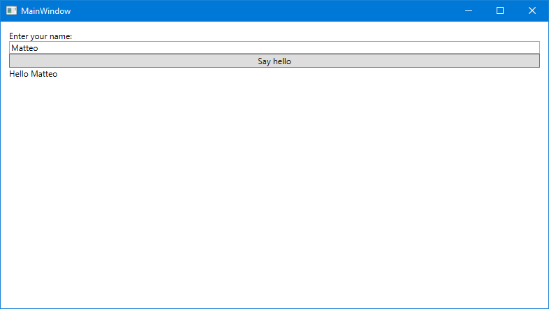
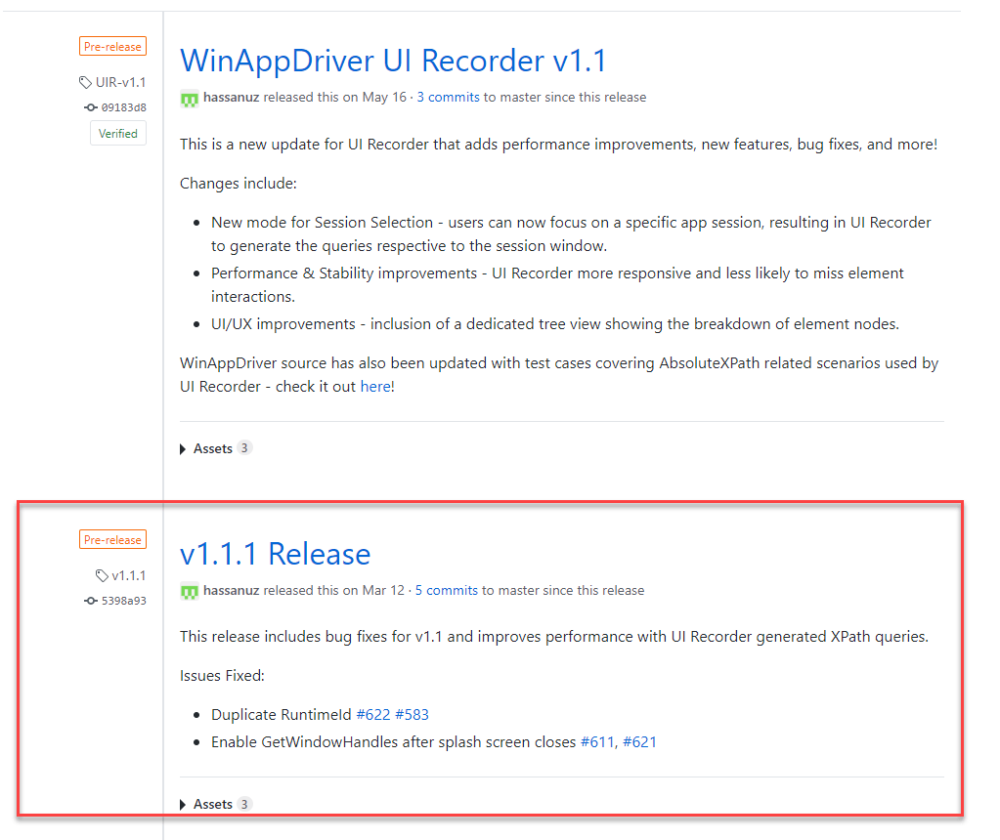
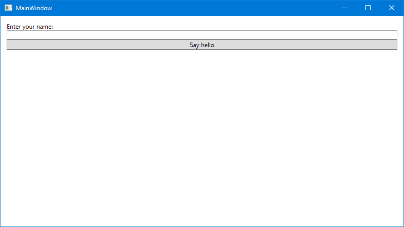
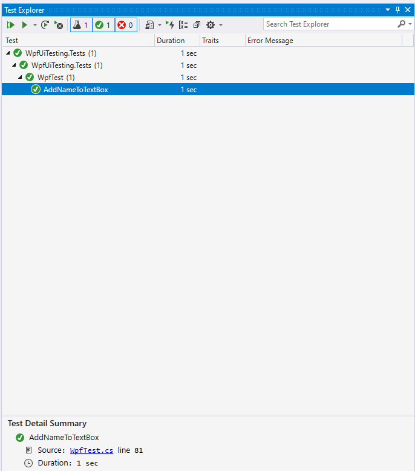
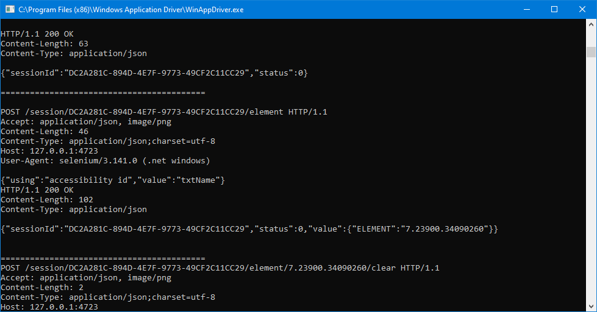
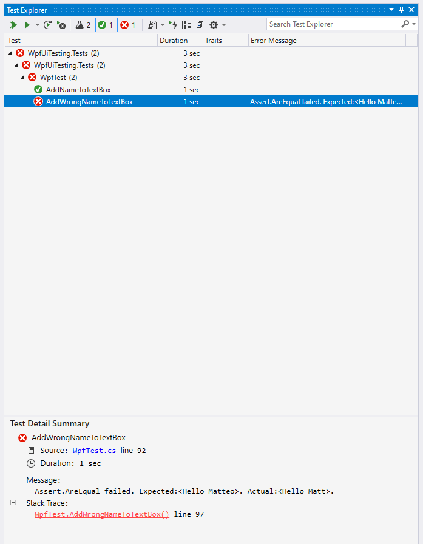
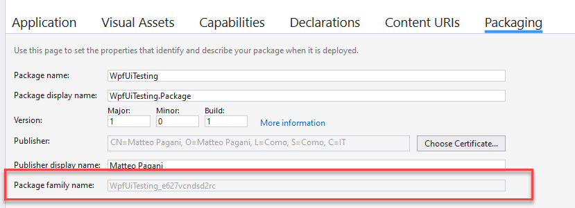
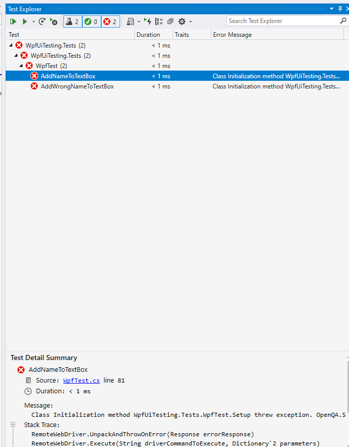

# UI testing for Windows apps with WinAppDriver

An important aspect to properly adopt a DevOps approach for your software project is testing. In order to be agile and deliver fast, you need to make sure that the quality bar is always met. This is where automated testing comes in. When we commit new code to our repository, we need to make sure we haven't broken anything before releasing a new version of our application.
When we implement testing, typically we focus only on the business logic side. This is why we often adopt unit testing, which takes our logic and split it into small pieces, which are tested separately and independently. However, client applications aren't made only by business logic, but also the user interface plays an important role. The business logic of our application, in fact, can be bug free, but there may be visual issues that we have missed because they happen only on a specific device. For example, if our UI doesn't fully support screens with high DPIs, an important button or another actionable item might not be visible, preventing our customers to use the application. This is especially true in today's world where, across desktop and mobile platforms, we have lot of different resolutions, screen size, form factors, etc.

However, UI testing isn't "easy" to do as unit testing. The full application must be up & running, while unit testing takes care of performing small tasks, which should be as much isolated and independent from each other. Additionally, unit testing tests only code, so to trigger the execution you just need to invoke that code (a method, a class, etc.). In UI testing, instead, you need to actually interact with the application, in order to trigger events.

Please welcome [Windows Application Driver](https://github.com/microsoft/WinAppDriver) (from now on, WinAppDriver), which is an open source service which supports performing UI automation against Windows applications, regardless of the technology used to build it (UWP, WPF, Windows Forms, Win32, etc.). Under the hood, WinAppDriver is nothing more than a REST service, which supports performing commands against a Windows application by leveraging HTTP methods and JSON payloads. However, thanks to a testing framework called [Appium](http://appium.io/), we can use a dedicated SDK to simulate commands and actions executed by our application. We can simulate the pressing of a button; or the typing of a text inside a TextBox; etc. This way, we can simulate the most common flow of actions and interactions performed by the user and make sure that everything works as expected.

Recently, WinAppDriver has also been added to the Azure DevOps offering. The service, in fact, comes pre-installed on every Windows hosted agent and, with a dedicated task, we can simply start and stop it whenever we need it. This way, we can include UI testing as part of our CI/CD pipeline and make sure that all the UI tests are executed whenever we commit new code to our repository.

In this article we're going to learn the basics of adding UI tests to a WPF application, by leveraging WinAppDriver and Appium. In [the next article](https://github.com/microsoft/WinAppDriver/tree/master/Docs/UITestingForWindows-AzureDevOps.md), instead, we're going to learn how to integrate this flow into our CI/CD pipeline.

### Let's build a WPF app!
As starting point, we're going to build a simple WPF app, which we're going to put under UI testing. The choice between the traditional .NET Framework or the shiny new .NET Core 3.0 is up to you: Appium relies on the visual elements of the application, not on the technology leveraged to build it.
The purpose of the app is really simple: in a TextBox we're going to write our name; by pressing a button, we're going to display a greeting message in the form of "Hello" followed by the name you've typed.
Here is the UI:

```xml
<Window x:Class="WpfUiTesting.Wpf.MainWindow"
        xmlns="http://schemas.microsoft.com/winfx/2006/xaml/presentation"
        xmlns:x="http://schemas.microsoft.com/winfx/2006/xaml"
        xmlns:d="http://schemas.microsoft.com/expression/blend/2008"
        xmlns:mc="http://schemas.openxmlformats.org/markup-compatibility/2006"
        xmlns:local="clr-namespace:WpfUiTesting.Wpf"
        mc:Ignorable="d"
        Title="MainWindow" Height="450" Width="800">
    
    <StackPanel x:Name="StackRoot">
        <TextBlock Text="Enter your name:" />
        <TextBox x:Name="txtName" >
        <Button Click="OnSayHello" x:Name="sayHelloButton" Content="Say hello" />
        <TextBlock x:Name="txtResult" />
    </StackPanel>
</Window>
```

Nothing fancy: a TextBox where to type the name; a button to trigger the action; a TextBlock to display the greeting message.



As you can guess, also the event handler **OnSayHello**, which is executed when the button is pressed, is simple as well:

```csharp
private void OnSayHello(object sender, RoutedEventArgs e)
{
    txtResult.Text = $"Hello {txtName.Text}";
}
```

### Let's add some UI testing
Now let's add some testing. We want to make sure that, whenever the user presses the "Say hello" button, the TextBlock named **txtResult** contains effectively the string "Hello" followed by the value typed by the user in the TextBox named **txtName**.
The first step is to create a testing project. Appium offers a SDK which allows to identify UI elements on the screen and to interact with them, leveraging WinAppDriver. As such, it isn't tight to a specific testing framework, but we can use the one we prefer most. In my case, I'm going to use the inbox Visual Studio solution, which is MSTest.
Right click on your solution and a new project which type is Unit Test Project (.NET Framework):


Now we need to install the Appium SDK, which will give us classes and methods to interact with the UI of the application. Right click on the test project, choose **Manage NuGet packages**, look for and install the package called [Appium.WebDriver](https://www.nuget.org/packages/Appium.WebDriver/).
Before starting to actually write some tests, we need to do some preparation! First, we need WinAppDriver up & running, since it acts as a middle man between our tests and the WPF application. We can download it from the [Releases](https://github.com/microsoft/WinAppDriver/releases) section of the GitHub project. Be aware, you need to download the service, not WinAppDriver UI Recorder, which is a different tool. At the time of writing, 1.1.1 is the latest release.



After you have downloaded the MSI and executed it, you will find the service installed at the location **c:\Program Files (x86)\Windows Application Driver**. Go there and double click on the **WinAppDriver.exe** file to launch it. The service is a command line tool, so you will see a command prompt appearing with the information about the URL and the port which the service is listening to. The default one is **http://127.0.0.1:4723/**. The command prompt will act also as a logger: every time the Appium SDK will perform any interaction, we will see the underline HTTP requests and JSON payloads being displayed in the window.

#### Initialize the session
Before starting a test, we need to initialize an Appium session: we need to specify which is the application we want to launch, the target platform, the WinAppDriver URL, etc. We do this inside a method decorated with the **[ClassInitialize]** attribute, which is the one used by MSTest to define a method that must be invoked every time we start a new testing session.
Let's take a look at the code, which we'll comment later:

```csharp
[TestClass]
public class WpfTest
{
  protected const string WindowsApplicationDriverUrl = "http://127.0.0.1:4723";
  private const string WpfAppId = @"C:\WpfUiTesting\WpfUiTesting.Wpf\bin\Debug\WpfUiTesting.Wpf.exe";

  protected static WindowsDriver<WindowsElement> session;

  [ClassInitialize]
  public static void Setup(TestContext context)
  {
      if (session == null)
      {
          var appiumOptions = new AppiumOptions();
          appiumOptions.AddAdditionalCapability("app", WpfAppId);
          appiumOptions.AddAdditionalCapability("deviceName", "WindowsPC");
          session = new WindowsDriver<WindowsElement>(new Uri(WindowsApplicationDriverUrl), appiumOptions);

      }
  }
}
```

We define a couple of constants to hold some information. The first one, called **WindowsApplicationDriverUrl**, is the URL where the WinAppDriver service is available (do you remember the URL we have seen when we have launched the service in the previous section?). The second one, called **WpfAppId**, is the identifier of the application which, in case of a Win32 one, is the full path of the executable. In this case, we use the executable created inside the folder with the build output of the Visual Studio project we have previously created. 
Lastly, we define a static property to store our session, which type is **WindowsDriver\<WindowsElement>**. These classes are actually coming from the Appium SDK: we are using the driver for Windows to connect to one or more application windows (sorry if it sounds like a bad joke :-)). 

The **Setup()** method is the one decorated with the **[ClassInitialize]** attribute, which means that it will be executed before each test session. To bootstrap a session, Appium supports multiple parameters, which are handled with the collection **AppiumOptions**. The only required one is **app**, which must contain the identifier of the application we want to test. In case of a Win32 application, it's the full path of the executable. For clarity, we also specify the **deviceName** one, which tells to the framework which platform our application is targeting (in our case, **WindowsPC**). Appium, in fact, isn't a testing framework only for Windows desktop apps, but it fully supports also mobile apps and web apps.
In the end, we start a new session by creating a new instance of the **WindowsDriver\<WindowsElement>** object, passing a parameter the WinAppDriver url and the options we have just created.

#### Making our app testable
As already mentioned, the way Appium works is that, through WinAppDriver, is able to walk through the tree of visual object which compose the window of our application and interact with the various controls in an automated way, without any user interaction. Let's take another look at the window of the application we have built to better understand the scenario.



There are 3 controls we need to interact with:

- The TextBox where to type the name
- The Button to trigger the interaction
- The TextBlock where the result will appear

We don't need, for example, to interact with the first TextBlock, which is just a header with an informative text. Or with the window itself. As such, the first problem which arises is finding the right way to identify which objects we are interested to.

The session object we have built in the previous section provides multiple methods to find elements in the window, suitable for different type of applications. For example, the **FindElementByTagName()** and **FindElementByCssSelector()** methods are dedicated to web applications. One of the most useful that we can leverage for a desktop application is called **FindElementByAccessibilityId()**, which uses the automation properties supported by Windows to identify a specific element for accessibility purposes. So, before writing the tests, let's wire some of these properties.

```xml
<Window x:Class="WpfUiTesting.Wpf.MainWindow"
        xmlns="http://schemas.microsoft.com/winfx/2006/xaml/presentation"
        xmlns:x="http://schemas.microsoft.com/winfx/2006/xaml"
        xmlns:d="http://schemas.microsoft.com/expression/blend/2008"
        xmlns:mc="http://schemas.openxmlformats.org/markup-compatibility/2006"
        xmlns:local="clr-namespace:WpfUiTesting.Wpf"
        mc:Ignorable="d"
        Title="MainWindow" Height="450" Width="800">
    
    <StackPanel x:Name="StackRoot">
        <TextBlock Text="Enter your name:" />
        <TextBox x:Name="txtName" AutomationProperties.AutomationId="txtName"/>
        <Button Click="OnSayHello" AutomationProperties.AutomationId="sayHelloButton" Content="Say hello"  />
        <TextBlock x:Name="txtResult" AutomationProperties.AutomationId="txtResult" />
    </StackPanel>
</Window>
```

As you can see, we have assigned an identifier to the controls we need to interact with, using the attached property **AutomationProperties.AutomationId**. Now we can reference the controls from the Appium SDK using these identifiers. Let's create a first simple test:

```csharp
[TestMethod]
public void AddNameToTextBox()
{
    var txtName = session.FindElementByAccessibilityId("txtName");
    txtName.SendKeys("Matteo");
    session.FindElementByAccessibilityId("sayHelloButton").Click();
    var txtResult = session.FindElementByAccessibilityId("txtResult");
    Assert.AreEqual(txtResult.Text, $"Hello {txtName.Text}");
}
```

The purpose of this test is to verify that the basic UI interaction of the application works well. We want to type something in the TextBox, press the button and make sure that the TextBlock will display the message "Hello" followed by what we have typed.

You can assign to the method the name you prefer. The important part is that you mark it with the **[TestMethod]** attribute, which is the one used by MSTest to identify which are the actual tests to execute. Inside the test, we leverage the session we have previously created and the identifiers we have previously assigned in XAML to get a reference to the controls we want to interact with. We just need to invoke the **FindElementByAccesibilityId()** method, followed by its identifier. Once we have the reference, the SDK offers many methods to simulate the most common type of interactions. You can see two of them in the code:

- We simulate the user typing something, by calling the **SendKeys()** method on the TextBlock. As parameter, we pass the text we want to type, in my case **Matteo**.
- We simulate the button click, by calling the **Click()** method on the Button.

In the end, we use the **Assert.AreEqual()** method of MSTest to check if the string stored in the **Text** property of the TextBlock actually matches the string "Hello" followed by the content of the TextBox.

### Testing the test :-)
Before running the test, we need to make sure:

- WinAppDriver is up & running. If not, make sure to double click on **WinAppDriver.exe** in the **C:\Program Files (x86)\Windows Application Driver** folder.
- We have compiled at least once the WPF application. Building the tests, in fact, doesn't automatically trigger the compilation of the application. Make sure that the executable is stored in the same path you have specified in the **WpfAppId** constant declared in the test class.

Now right click on the test project and choose **Run Tests**. If you have done everything properly, you should see some voodoo magic happening :-) The WPF application will start, then you will see the text "Matteo" being automatically typed inside the TextBox and the button being clicked.
If you now open the Test Explorer tab in Visual Studio (you can find it under the **View** menu), you should see that the test is passing:



If you open the command prompt where WinAppDriver is running, you will see the HTTP calls that have been performed under the hood. For example, the following one happens when the test suite tries to identify the element with id **txtName**:



### Improving our test class
Everything went well, but if we try to repeat the test plan or to add another test, we will notice some not so great behaviors:

- When the test session is completed, the WPF application is left open. As such, every test plan will launch a new instance of the WPF application, leading to have lot of instances of the application running at the same time, which can create troubles to WinAppDriver when it looks for the window where to execute the tests.
- Let's say we want to run another test which involves typing something else in the TextBox. The test outcome will be compromised by the fact that the TextBox already includes a text, which was the input of the first test.

To make our test suite better and to solve these problems, we can leverage two features of MSTest (which are offered as well by every major testing suite). The first one is the ability to define a test initialization method, which will be invoked before every test (which shouldn't be confused with the one we already have decorated with the **[ClassInitialize]** attribute, which instead is global and it's invoked once before running all the tests in the suite). We can easily define a method that will clear the content of the TextBox, so that every test will start from a clean situation. Here is how to define it:

```csharp
[TestInitialize]
public void Clear()
{
    var txtName = session.FindElementByAccessibilityId("txtName");
    txtName.Clear();
}
```

All we need to do is to mark it with the **[TestInitialize]** attribute. Inside the method, we just use the familiar **FindElementByAccessibilityId()** method exposed by the session to find the TextBox and clear all the text, by using the **Clear()** method.

The second feature is the ability to define a cleanup method, which will be invoked when all the tests have been executed. We're going to use it to close the application:

```csharp
[ClassCleanup]
public static void Cleanup()
{
    if (session != null)
    {
        session.Close();
        session.Quit();
    }
}
```

This method is defined as **static** and it's marked with the **[ClassCleanup]** attribute. Inside it, we close the session by calling the **Close()** method and then we quit the app, by invoking the **Quit()** method.

To make sure everything is working, let's add another test. This time, we're going to add one that will lead to a failure:

```csharp
[TestMethod]
public void AddWrongNameToTextBox()
{
    var txtName = session.FindElementByAccessibilityId("txtName");
    txtName.SendKeys("Matteo");
    session.FindElementByAccessibilityId("sayHelloButton").Click();
    var txtResult = session.FindElementByAccessibilityId("txtResult");
    Assert.AreEqual(txtResult.Text, $"Hello Matt");
}
```

This test is similar to the previous one. The only difference is that it will check the result against the fixed string **Hello Matt** which, of course, will cause a failure because the test actually types the name Matteo in the TextBox.
Now run again the tests and you will notice two things:

- Between the execution of the first and the second test, the TextBox will be cleared.
- At the end of the test, the application will be closed.

As a bonus, we can use the failed test to see what happens in such a scenario. The Test Explorer tool will clearly display the exception that has been raised:



As you can see, the message is pretty clear: the TextBlock contains the text **Hello Matteo**, while the string we have used for comparison is **Hello Matt**.
What if was another kind of exception, not related to a failed assert? Tests are, in the end, code, so they can include bugs as well! In this case, you can right click on the test project and choose **Debug Tests**. A real debugger will be attached, allowing you to set breakpoints or to analyze the code in case of exceptions, like you would do with the real application.

### Testing a packaged application
Which is the best way to deploy and distribute our WPF application? [MSIX](https://aka.ms/msix), of course! Let's package our application then! You can find more information on how to package an application with MSIX in Visual Studio by reading the [official documentation](https://docs.microsoft.com/en-us/windows/msix/desktop/desktop-to-uwp-packaging-dot-net).
Right click on your solution, choose **Add -> New Project** and choose the Windows Application Packaging Project template. Once it has been created, right click on **Applications**, choose **Add reference** and select the WPF project. That's it!

If we stop for a minute to think, however, we will realize that the current test suite isn't suitable for a packaged application. We have set, as entry point, the full executable deployed by Visual Studio, but this isn't how a MSIX package works.  You don't manually launch an executable, Windows does that for you based on the entry point defined in the manifest. And it could not even be a standard Win32 executable, since WinAppDriver supports testing also UWP application.
We need to change the way we define our entry point. Luckily, it's quite easy:

```csharp
[TestClass]
public class WpfTest
{
    protected const string WindowsApplicationDriverUrl = "http://127.0.0.1:4723";
    private const string WpfAppId = @"WpfUiTesting_e627vcndsd2rc!App";

    protected static WindowsDriver<WindowsElement> session;

    [ClassInitialize]
    public static void Setup(TestContext context)
    {
        if (session == null)
        {
            var appiumOptions = new AppiumOptions();
            appiumOptions.AddAdditionalCapability("app", WpfAppId);
            appiumOptions.AddAdditionalCapability("deviceName", "WindowsPC");
            session = new WindowsDriver<WindowsElement>(new Uri(WindowsApplicationDriverUrl), appiumOptions);
        }
    }
}
```

The initialization code is the same, except for the identifier of the app, which isn't anymore the full path of the executable, but it's the Package Family Name followed by the **!App** suffix. We can find the Package Family Name by double clicking on the **Package.appxmanifest** file in the Windows Application Packaging Project and moving to the **Packaging** tab:



It's a unique value, generated based on the package name and a hash of your publisher name.
That's it. Now deploy the packaged application at least once (right click on the Windows Application Packaging Project and choose **Deploy**), then run the tests again. You will see the packaged version of the app starting automatically, ready to receive inputs from WinAppDriver. However, the outcome won't be the same as before.



All the tests are now failing with the following error:

```text
Class Initialization method WpfUiTesting.Tests.WpfTest.Setup threw exception. OpenQA.Selenium.WebDriverException: OpenQA.Selenium.WebDriverException: Failed to locate opened application window with appId: WpfUiTesting_e627vcndsd2rc!App, and processId: 26244
```

The MSIX packaging, unfortunately, messed up a bit our testing and, despite the appId and the processId are correct, WinAppDriver isn't able to locate anymore the main window of our application. Are we doomed? Of course not! The Appium SDK offers an option to create a desktop session instead of an app session which, instead of giving us access to single UI elements of an application, it gives us access to all the UI elements inside Windows. This option is useful when we need to test, for example, special activation scenarios, like Cortana or a protocol, in which the starting point isn't the application traditionally opened because the user has double clicked on an icon.
This option allows us also to implement a workaround for our blocker. Thanks to a desktop session, we can manually look for the window of our application and get a reference to it. Using this approach will make the test suite initialization a little bit more verbose, but it will make things working again. It sounds like a reasonable trade-off :-) 

As first step, we need to give a unique identifier to our window. We can use, again, the **AutomationProperties.AutomationId**:

```xml
<Window x:Class="WpfUiTesting.Wpf.MainWindow"
        xmlns="http://schemas.microsoft.com/winfx/2006/xaml/presentation"
        xmlns:x="http://schemas.microsoft.com/winfx/2006/xaml"
        xmlns:d="http://schemas.microsoft.com/expression/blend/2008"
        xmlns:mc="http://schemas.openxmlformats.org/markup-compatibility/2006"
        xmlns:local="clr-namespace:WpfUiTesting.Wpf"
        mc:Ignorable="d"
        AutomationProperties.AutomationId="WpfUITestingMainWindow"
        Title="MainWindow" Height="450" Width="800"
        >
    
    <StackPanel Margin="12">
        <TextBlock Text="Enter your name:" />
        <TextBox x:Name="txtName" AutomationProperties.AutomationId="txtName"/>
        <Button Click="OnSayHello" AutomationProperties.AutomationId="sayHelloButton" Content="Say hello" />
        <TextBlock x:Name="txtResult" AutomationProperties.AutomationId="txtResult" />
    </StackPanel>
</Window>
```

We have assigned to the **Window** the identifier **WpfUITestingMainWindow**, which we're going to use later.
Let's take a look at the updated test initialization code:

```csharp
[TestClass]
public class WpfTest
{
   protected const string WindowsApplicationDriverUrl = "http://127.0.0.1:4723";
   private const string WpfAppId = @"WpfUiTesting_e627vcndsd2rc!App";

   protected static WindowsDriver<WindowsElement> session;
   protected static WindowsDriver<WindowsElement> DesktopSession;

    public static void Setup(TestContext context)
    {
        if (session == null)
        {
            var appiumOptions = new AppiumOptions();
            appiumOptions.AddAdditionalCapability("app", WpfAppId);
            appiumOptions.AddAdditionalCapability("deviceName", "WindowsPC");
            DesktopSession = null;
            try
            {
                Console.WriteLine("Trying to Launch App");
                DesktopSession = new WindowsDriver<WindowsElement>(new Uri(WindowsApplicationDriverUrl), appiumOptions);
            }
            catch
            {
                Console.WriteLine("Failed to attach to app session (expected).");
            }

            appiumOptions.AddAdditionalCapability("app", "Root");
            DesktopSession = new WindowsDriver<WindowsElement>(new Uri(WindowsApplicationDriverUrl), appiumOptions);
            var mainWindow = DesktopSession.FindElementByAccessibilityId("WpfUITestingMainWindow");
            var mainWindowHandle = mainWindow.GetAttribute("NativeWindowHandle");
            mainWindowHandle = (int.Parse(mainWindowHandle)).ToString("x"); // Convert to Hex
            appiumOptions = new AppiumOptions();
            appiumOptions.AddAdditionalCapability("appTopLevelWindow", mainWindowHandle);
            session = new WindowsDriver<WindowsElement>(new Uri(WindowsApplicationDriverUrl), appiumOptions);
        }
    }
}
```

Other than the **WindowsDriver\<WindowsElement>** static object we were using to store the session, we create another one with the same type specific for the desktop session. The initialization code is the same as before, however we include the code to create the app session inside a try / catch statement, since it's likely going to fail. If that's the case, we need to fallback and use the desktop session. The way we initialize it is by setting the **app** capability to **root** instead of the path / Package Family Name of the application we want to test. This way, we'll be able to access to the visual tree of all the UI elements on the desktop. Then we look for the window of our application by using the familiar **FindelementByAccessibilityId()** method passing the identifier of the window as parameter.

Once we have identified the window, we get its handle, which we can use to create the specific UI session for our application. Appium, in fact, supports this approach by adding a new capability called **appTopLevelWindow** with, as parameter, the handle we have just retrieved.
In the end, we finally create and store our session, which we're going to use to perform all the tests. That's it! Using MSIX as a packaging technology changes the way we initialize the test suite, but it doesn't change the way the actual tests are executed. As such, all the rest of the code we have seen (the tests, the cleanup, etc. ) will continue to work without changes.

### Wrapping up
In this article we have seen the basic concepts around UI testing in Windows apps using WinAppDriver and Appium. Thanks to these tools, you're able to write tests which actually simulates the user interacting with the user interface of the application, so that you can be sure that, regardless of the screen, resolution and configuration of the user, he will always be able to interact with the application and perform the various tasks. The approach is quite straightforward, thanks to the Appium SDK. Once you have created a UI session, powered by WinAppDriver, you will be able to scan the visual tree of your application, get a reference to the UI elements you need and simulate the user interaction. In this post, we have seen the implementation of this approach both for a traditional WPF application and for its MSIX packaged version.
If you want to explore more the topic of Windows testing with WinAppDriver, read the next article, in which we're going to see how we can integrate everything we did in this post in a CI/CD pipeline, by leveraging the recently announced WinAppDriver integration in Azure DevOps.

In the meantime, you can explore the source code of the testing project used in this article [on GitHub](https://github.com/qmatteoq/WpfUiTesting).


